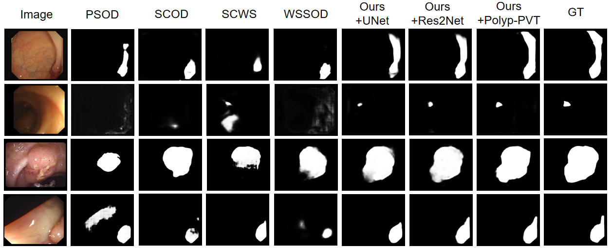

# TextPolyp: Point-Supervised Polyp Segmentation with Text Cues (MICCAI2024)

> **Authors:**
>
> *[Yiming Zhao*](),
> [*Yi Zhou*](https://cs.seu.edu.cn/yizhou/main.htm),
> [*Yizhe Zhang*](https://yizhezhang.com/),
> [*Ye Wu*](https://dryewu.github.io/),
> and [*Tao Zhou*](https://taozh2017.github.io).
>
> 

## 1. Preface

- This repository provides code for "_**TextPolyp: Point-Supervised Polyp Segmentation with Text Cues**_" MICCAI 2024. [Paper](https://link.springer.com/chapter/10.1007/978-3-031-72120-5_66) 


## 2. Overview

### 2.1. Introduction

Polyp segmentation in colonoscopy images is essential for preventing Colorectal cancer (CRC). Existing polyp segmentation models often struggle with costly pixel-wise annotations. Conversely, datasets can be annotated quickly and affordably using weak labels such as points. However, utilizing sparse annotations for model training remains challenging due to the limited information. 
We propose TextPolyp to tackle this issue by leveraging only point annotations and text cues for effective weakly-supervised polyp segmentation. Specifically, we utilize the Grounding DINO algorithm and Segment Anything Model (SAM) to generate initial pseudo-labels, which are then refined with point annotations. Furthermore, we employ a SAM-based mutual learning strategy to effectively enhance segmentation results from SAM. Our TextPolyp model is versatile and can seamlessly integrate with various backbones and segmentation methods. 

### 2.2. Framework Overview

<p align="center">
     <br />
    <em>
    Figure 1: Overview of the proposed framework. Our approach involves utilizing SegNet and SAM to produce masks(S_bas and S_ori) from a given image, while the gamma corrected image also serves as input for SAM to generate S_gam.
    </em>
</p>


### 2.3. Qualitative Results

<p align="center">
     <br />
    <em> 
    Figure 2: Visualization results of different methods on the polyp segmentation.
    </em>
</p>

## 3. Proposed Method

### 3.1. Training/Testing

The training and testing experiments are conducted using [PyTorch](https://github.com/pytorch/pytorch) with one NGeForce RTX3090 GPU with 24 GB Memory.

1. Configuring your environment (Prerequisites):

    Note that PraNet is only tested on Ubuntu OS with the following environments. 
    It may work on other operating systems as well but we do not guarantee that it will.
    
    + Creating a virtual environment in terminal: `conda create -n TextPolyp python=3.6`.

    + Installing necessary packages: `pip install -r requirements.txt`.

2. Downloading necessary data:

    + downloading Polyp dataset
    which can be found from [Google Drive Link](https://drive.google.com/drive/folders/1iMJYI1aNNegdUyXj8vDuRNVvR6z3Rq50?dmr=1&ec=wgc-drive-hero-goto), or [Baidu Drive](https://pan.baidu.com/s/1nYysmRo8Li6QB7NL6ZRFeA) (extraction code: esgj).
    
    + downloading Grounding DINO for Pesudo-label generation
    which can be found from [GitHub](https://github.com/IDEA-Research/GroundingDINO), and the process of generating pseudo-labels by combining point with SAM is located in the `./pseudo` folder.
    
    + downloading SAM weights and move it into `./checkpoints/sam_vit_b_01ec64.pth`,
    which can be found from [GitHub](https://github.com/facebookresearch/segment-anything?tab=readme-ov-file#model-checkpoints).

3. Preprocessing:

    + Download training and data and put them into `./data` folder with the following structure:
       ```
       |-- data
       |   |-- TrainDB
       |       |-- image
       |       |-- point
       |       |-- gamma
       |       |-- pseudo
       |   |-- TestDB
       |       |-- CVC-300
       |       |-- CVC-ClinicDB
       |       |-- CVC-ColonDB
       |       |-- ETIS-LaribPolypDB
       |       |-- Kvasir
       ```
    + Download the pre-trained model.

4. Training:
    
    + After processing, just run `python train.py` to train our model.

5. Testing:

    + After you download the testing dataset and put them into `./data` , just run `python test.py` to generate the final prediction maps.

## 4. Citation

Please cite our paper if you find the work useful, thanks!

    @inproceedings{zhao2024textpolyp,
    title={TextPolyp: Point-Supervised Polyp Segmentation with Text Cues},
    author={Zhao, Yiming and Zhou, Yi and Zhang, Yizhe and Wu, Ye and Zhou, Tao},
    booktitle={International Conference on Medical Image Computing and Computer-Assisted Intervention},
    pages={711--722},
    year={2024},
    organization={Springer}
    }

## 5. License

The source code and dataset are free for research and education use only. Any comercial use should get formal permission first.

---

**[⬆ back to top](#1-preface)**
